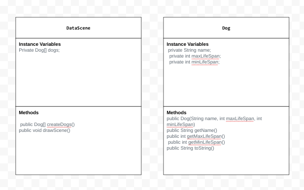
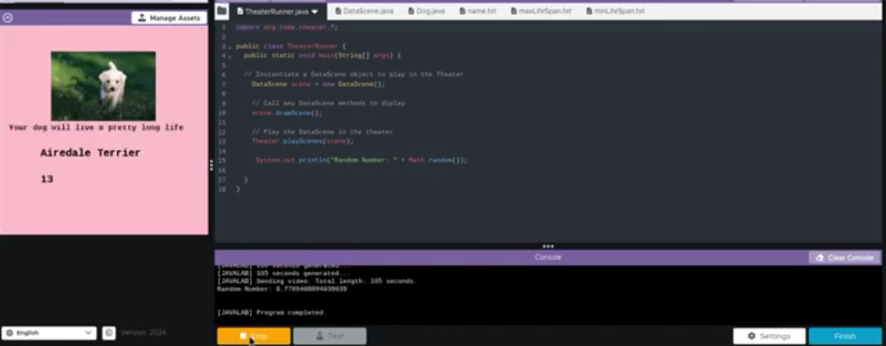

# Unit 4 - Abstract Art Project

## Introduction

Data visualizations are powerful tools to present information and convey patterns and relationships. Sometimes visualizations are charts or graphs, and other times they are more abstract pieces of art. Your goal is to create a visual representation relating at least two categories from your dataset that engages your viewer and encourages them to learn more about your chosen topic.

## Requirements

Use your knowledge of object-oriented programming, one-dimensional (1D) arrays, and algorithms to create your data visualization program:

- **Create at least two 1D arrays** – Create at least two 1D arrays to store the data that will make up your visualization.
- **Implement one or more algorithms** – Implement one or more algorithms that use two-way or multi-selection statements with compound Boolean expressions to analyze the data.
- **Use methods in the Math class** – Use one or more methods in the Math class in your program, such as to perform calculations on the values in your dataset and display the results, choose random values from the dataset, or display images or shapes at random locations.
- **Create a visualization** – Create an image or animation that conveys the story of the data by illustrating the patterns or relationships in the data.
  Note: This may be abstract! Others do not necessarily need to know what the story or pattern is right away, but you do need to be able to explain it to them.
- **Document your code** – Use comments to explain the purpose of the methods and code segments and note any preconditions and postconditions.

## Dataset

Include a hyperlink to the source of your dataset used for this project. Additionally, provide a short description of each column used from the dataset, and the data type.

Example:

Dataset: https://thedogapi.com/ 

- **Name** (String) - name of the dog breed
- **Minimum Life Span** (int) - minimum life span in years of the dog breed
- **Maximum Life Span** (int) - maximum life span in years of the dog breed

## UML Diagram

Put and image of your UML Diagram here. Upload the image of your UML Diagram to your repository, then use the Markdown syntax to insert your image here. Make sure your image file name is one work, otherwise it might not properly get display on this README.

## Video Demo

Record a short video of your abstract art animation to display here on your README. You can do this by:

- Screen record your project running on Code.org.
- Upload that recording to YouTube.
- Take a thumbnail for your image.
- Upload the thumbnail image to your repo.
- Use the following markdown

)

## Description

My project is an interactive data visualization that showcases a dataset of dogs, focusing on their names and life spans. The goal is to allow users to explore the dogs' details through a theater-like scene where each dog's information is displayed dynamically. The dataset consists of three text files: name.txt, maxLifeSpan.txt, and minLifeSpan.txt, which contain the names, maximum life spans, and minimum life spans of various dogs. I use these files to create Dog objects, each representing a dog with attributes like name, maximum life span, and minimum life span. The DataScene class, which extends the Scene class from the org.code.theater library, manages the visual representation. Inside the drawScene method, the program uses color coding to differentiate between dogs with shorter life spans (blue) and those with longer life spans (pink). Each dog's name and maximum life span are displayed, and a dog image is shown alongside these details. Additionally, a sound effect of a dog barking is played to enhance the experience. The Dog class includes accessor methods to retrieve the name, max life span, and min life span of each dog. While the project could be expanded to include user input via the Scanner class for selecting specific dogs or filtering based on life span, it currently automatically displays the information for each dog in sequence. This project effectively combines data visualization with interactive elements to create a visually engaging experience for the user, helping them learn about the dogs' life expectancies and names.